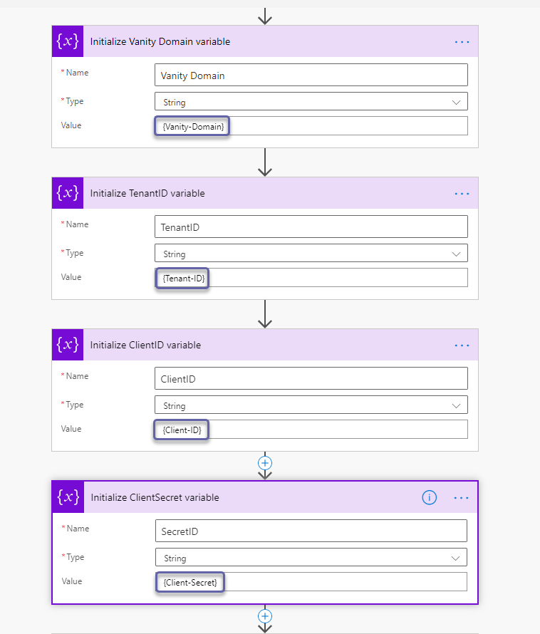

# teams-health-feature-monitoring

| [About The Project](#about-the-project) | [Usage](#usage) | [Prerequisites](#prerequisites) | [Installation](#installation)
| ---- | ---- | ---- | ---- | 

Microsoft Teams Message Center and Service Health Notifications as Teams posts and stored to SharePoint lists. With just one Power Automate flow (including a SharePoint site and Teams channel), you can stay informed about anything important for Microsoft Teams.

## Table of Contents

- [teams-health-feature-monitoring](#teams-health-feature-monitoring)
  - [Table of Contents](#table-of-contents)
  - [About The Project](#about-the-project)
    - [Built With](#built-with)
  - [Getting Started](#getting-started)
    - [Prerequisites](#prerequisites)
    - [Installation](#installation)
      - [1. Clone the repo or download the files directly](#1-clone-the-repo-or-download-the-files-directly)
      - [1. Create an App Registration in Azure AD](#1-create-an-app-registration-in-azure-ad)
      - [2. Create a SharePoint site](#2-create-a-sharepoint-site)
      - [3. Import the SharePoint lists](#3-import-the-sharepoint-lists)
      - [4. Import the Power Automate flow](#4-import-the-power-automate-flow)
      - [5. Adjust the values in the Power Automate](#5-adjust-the-values-in-the-power-automate)
  - [Usage](#usage)
  - [Other Workloads](#other-workloads)
  - [Follow-ups (Tasks)](#follow-ups-tasks)
  - [Roadmap](#roadmap)
  - [Contributing](#contributing)
  - [License](#license)
  - [Contact](#contact)


## About The Project

The project includes **one** simple Power Automate solution to stay informed about the Microsoft Teams Service issues and upcoming changes to the service that may require administrator or end-user attention. :rocket:  

  

The Power Automate will fetch every **20 Minutes** the latest updates from the Office 365 Service Health Status and the Message Center using the Graph API and post them to Teams (if required) and store the information to SharePoint lists.

:bangbang: **TIP:** *The solution is designed for Microsoft Teams but can also be used for all other Office 365 services by simply changing the filters inside the flow.*

### Built With

* [Power Automate](https://us.flow.microsoft.com/)
* SharePoint Online Lists
* Graph API ([serviceAnnouncement](https://docs.microsoft.com/en-us/graph/api/resources/serviceannouncement?view=graph-rest-1.0))

## Getting Started

To get a local copy up and running follow these simple steps.

### Prerequisites

The solution require an Office 365 subscription including the following:

- Microsoft Teams license
- Power Automate license (Premium Connector)
- SharePoint license
- PnP PowerShell Module (SharePoint Online)
- Access to Azure AD to create App Registration

### Installation

#### 1. Clone the repo or download the files directly

Clone the repo:

```sh
git clone https://github.com/tobiheim/teams-health-feature-monitoring.git
```

#### 1. Create an App Registration in Azure AD

   First open the Azure AD Portal (https://aad.portal.azure.com) and select **App registrations**.  

   

   Create a new registration:  

   

   Provide a name to your new app and select the supported account type as shown in the screenshot below. Now you can register the app.

   

   Also copy the **Application ID** and the **Tenant ID** from the overview section.

   

   Next you need to add permissions to your app registration.

   

   Select **Add a permission**

   

   Select **Graph API**

   

   Next select **Application permissions**

   

   Select the permissions listed in the screenshot below:

   
  
   After selecting the permissions, click **Add permission**.

   Don't forget to grant admin consent for your organization.

   

   As last step you need to create a client secret for your app.  
   **Note:** It is up to you what name and expiration time you select based on your requirements.

   

   Make sure to copy the client secret. You will need it later.

     

#### 2. Create a SharePoint site

   To create a new SharePoint page navigate to SharePoint Online using the menu in the top right corner.

     

   

   Select a Modern Team Site and add the required members and owners.

   

   **Note:** You can also use a already existing modern SharePoint site.  

   Copy the URL of the SharePoint site. You will need it later.

     

#### 3. Import the SharePoint lists

   After the new site is created you can apply the list template.
   The template includes two lists for the service issues and the message center notifications.

   Make sure to install the PnP PowerShell module.  
   https://pnp.github.io/powershell/

   `Install-Module -Name PnP.PowerShell`

   `Connect-PnPOnline -Url "https://{Vanity domain host name}.sharepoint.com/sites/{Your site name} -Interactive`

   

   The list template is part of this repo. You can apply it using the following cmdlet.

   `Invoke-PnPSiteTemplate -Path C:\Temp\SP_Lists_Template_TeamsHealthandFeatureMon_v2.xml -Handlers Lists`
  
   

   After you applied the template you should see the following newly created lists. If not, please refresh the browser.

   

#### 4. Import the Power Automate flow  

   Navigate to the Power Automate portal (https://us.flow.microsoft.com) and go to **My flows**.

   Select **Import** to add the flow template to your environment.

   

   When you import the flow you need to make sure to replace the existing connections as shown below:

   

   More details how to replace the connections can be found here:  
   https://docs.microsoft.com/en-us/power-automate/add-manage-connections  
   https://docs.microsoft.com/en-us/power-automate/create-team-flows#modify-a-connection  
   
   The included connections are used for the following reasons:  

|**Connections** |Description  |
|---------|---------|
|SharePoint Online     |This connector is used to connect, read and write to the SharePoint lists.         |
|Microsoft Teams     |Required to post messages to a Teams channel.        |
|Content Conversion    |Required to convert HTML to plain text.         |  

</br>

   After you replaced all the connections the import screen should look like this:

   

   Finally you can import the flow to your environment.

   

   

#### 5. Adjust the values in the Power Automate  

   As very last step you need to adjust the SharePoint and Teams connections inside the flow.

   First you need to adjust the app registration information as showing in the following example:  
   

   You need to adjust 6 times the SharePoint steps *(Make sure to select the correct list)*.  

   The flow is divided into two trees, each to control a specific aspect of the monitoring:  
    a. **Left hand side tree** to monitor a product health status (in this case Microsoft Teams and SfBO)  
    b. **Right hand side tree** to monitor the Message Center Notifications

   The flow is shipped with two SharePoint lists that you imported earlier, in the service issues side of the flow-tree, you need to point all SharePoint lists flow steps to Service Health Notification SharePoint List, the same for the Message Center Notification flow-tree but by pointing to the Message Center Notification SharePoint list instead.

      

   

   Last but not least you need to adjust the Teams steps to your channel (4 times).  
   

   **Note:** You could separate the incident posts from the message center posts into different channels if needed.

   :tada: **Let's go! Try it.**    
## Usage  

**Service Issues:**  
The flow will check for any Microsoft Teams related issues that are classified as **Service Degradation** and store this information to a SharePoint list.

As you can see the list template is configured with **conditional formatting** to highlight every degraded (red) and restored (green) service.

In addition to the list the flow will also post directly to a defined Teams channel. This way the admins stay informed without the need of checking the service health section in the Office 365 admin center all the time or subscribe to the notification mails that spams their inbox.

**Feature Updates:**  
The message center notification follows the same logic. Every Teams related entry will be stored in a SharePoint list. The list also includes pre-defined **conditional formatting** to highlight every entry that is tagged a "Plan for Change". Updates to the service will also be posted to Teams in case they require admin or user attention.

Here two examples:

**SharePoint List** 
  

**Teams Post**  


## Other Workloads

You can use the flow also for any other M365 Workload. All you need to do is to adjust the following filters in flow:


Next you need to adjust the HTML of the Teams posts (only the Title) to reflect the correct workload.

## Follow-ups (Tasks)

If you want to take action on any of the Teams posts then use **Tasks** in Teams.

  

  

## Roadmap  

The following item are on the Roadmap:

- Currently nothing planned.

See the [open issues](https://github.com/tobiheim/teams-health-feature-monitoring/issues) for a list of proposed features (and known issues).

## Contributing

Contributions are what make the open source community such an amazing place to be learn, inspire, and create. Any contributions you make are **greatly appreciated**.

1. Fork the Project
2. Create your Feature Branch (`git checkout -b feature/AmazingFeature`)
3. Commit your Changes (`git commit -m 'Add some AmazingFeature'`)
4. Push to the Branch (`git push origin feature/AmazingFeature`)
5. Open a Pull Request

## License

Distributed under the MIT License. See `LICENSE` for more information.

## Contact

Tobias Heim - [@saibothe](https://twitter.com/saibothe)  

**Thanks a lot to:**  
Mostafa Eid [@Lyncdude](https://twitter.com/Lyncdude) for contributing to the documentation.